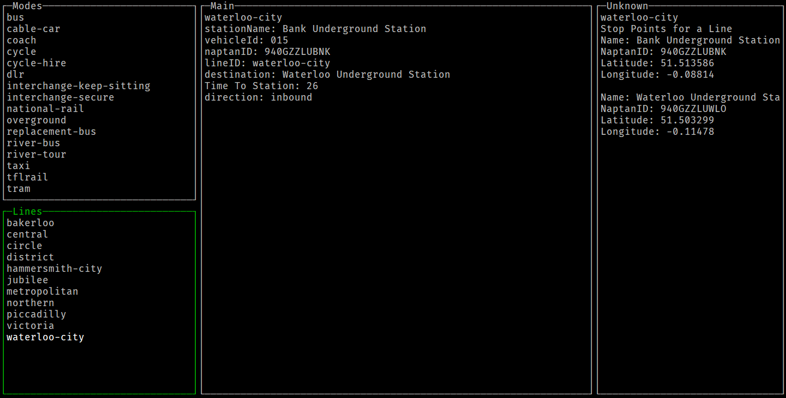

I started this project to test out learning go and making an library for the Transport For London train api.

It is not finished but has some useful functions for querying the api

there is a terminal ui for interacting with the api
the api was created using sling and can be accessed at github.com/haak/TFLMap/api
create a client and access the available services.

## SCREENSHOTS ##

